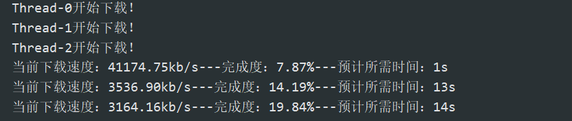
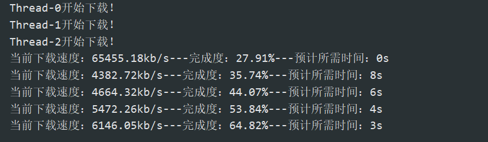
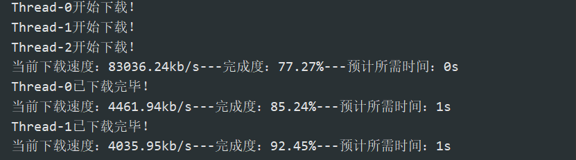
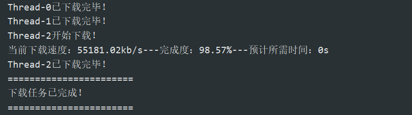

### 首次开启下载任务：

### 生成的文件：

### 第一次断点（测试完成度的计算是否正确）：

### 第二次断点：

此时Thread-0和Thread-1已经完成下载任务，此次断点主要为了测试某些线程完成了下载任务，还有其他未完成的情况下程序是否正常运行。

### 下载完成（已经完成的线程会提示下载完毕，未完成的线程会继续下载）：

### 下载完成后的文件：

### 运行正常：

